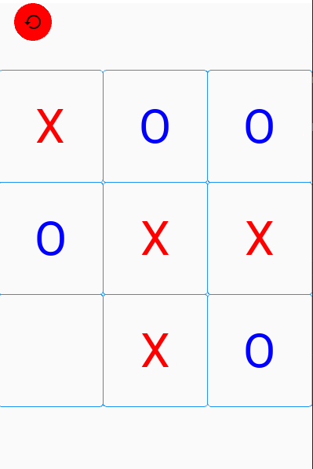
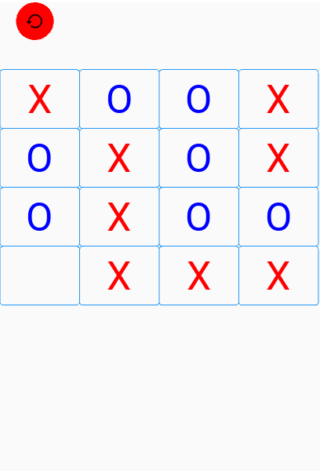
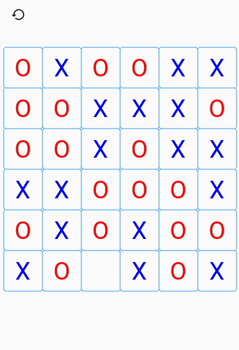
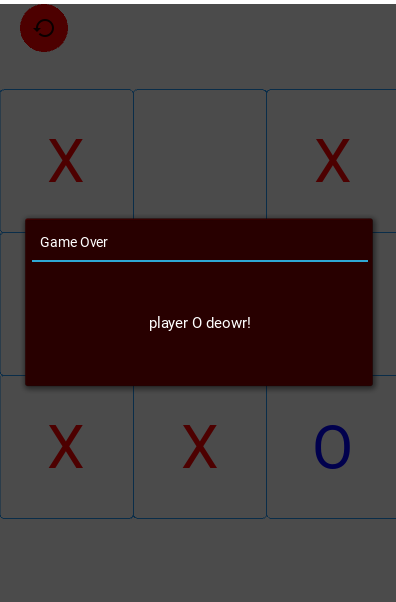

---

# 🎮 XO Game – Smart Levels

A modern version of the classic *XO (Tic-Tac-Toe)* game with 3 smart difficulty levels and a Win/Lose screen.

---

## 📸 Game Screenshots

<table>
  <tr>
    <td align="center">
      <b>🟢 Easy Level</b> 
      
    </td>
    <td align="center">
      <b>🟡 Medium Level</b> 
      
    </td>
  </tr>
  <tr>
    <td align="center">
      <b>🔴 Hard Level</b> 
      
    </td>
    <td align="center">
      <b>🏆 Win / Lose</b> 
      
    </td>
  </tr>
</table>

---

## ✨ Features
- Clean and attractive design  
- Three levels: Easy, Medium, Hard  
- Engaging Win/Lose animations and feedback  
- Built with *Python & Kivy/KivyMD*  
- Expandable for future stages and new games

Expandable for future stages and new games
